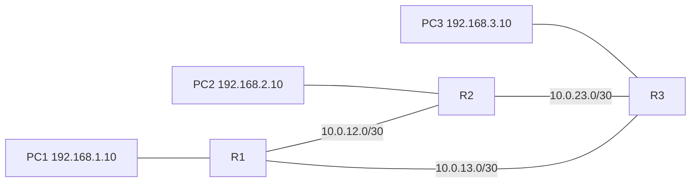

# Lab Cisco : OSPF sur trois routeurs

> **Statut : à réaliser.** Ce guide est préparé à partir de la documentation officielle et de mes cours ; **je ne l'ai pas encore rejoué de bout en bout**. Les commandes sont à valider en le faisant, et le journal en bas de page sera complété avec mes résultats réels (captures, erreurs rencontrées, corrections).

## Objectif

Relier trois routeurs en triangle et laisser **OSPF** (aire 0) annoncer automatiquement les réseaux, au lieu d'écrire des routes statiques. Observer ensuite la **convergence** quand un lien tombe.

À la fin, je saurai : activer OSPF sur des interfaces précises, désactiver les annonces sur les réseaux d'utilisateurs (`passive-interface`), lire la table de voisinage et la table de routage, influencer le choix du chemin avec le coût.

## Prérequis

- Cisco Packet Tracer (routeurs 2911 ou 4331) ou GNS3.
- Notions : adressage IPv4, masque inverse (*wildcard*), table de routage.

## Topologie



## Plan d'adressage

| Routeur | Interface | Adresse | Réseau |
|---|---|---|---|
| R1 | g0/0 | 192.168.1.1/24 | LAN 1 |
| R1 | g0/1 | 10.0.12.1/30 | R1-R2 |
| R1 | g0/2 | 10.0.13.1/30 | R1-R3 |
| R2 | g0/0 | 192.168.2.1/24 | LAN 2 |
| R2 | g0/1 | 10.0.12.2/30 | R1-R2 |
| R2 | g0/2 | 10.0.23.1/30 | R2-R3 |
| R3 | g0/0 | 192.168.3.1/24 | LAN 3 |
| R3 | g0/1 | 10.0.23.2/30 | R2-R3 |
| R3 | g0/2 | 10.0.13.2/30 | R1-R3 |

Les PC ont pour passerelle l'adresse `.1` de leur routeur. Le plan des liaisons en /30 se calcule avec [calculateur-sous-reseaux](https://github.com/mehdiseg/calculateur-sous-reseaux).

## Étapes

### 1. Adresser les interfaces

Fichier du dépôt : [`configs/R1.txt`](configs/R1.txt)

```text
enable
configure terminal
hostname R1
interface g0/0
 ip address 192.168.1.1 255.255.255.0
 no shutdown
interface g0/1
 ip address 10.0.12.1 255.255.255.252
 no shutdown
interface g0/2
 ip address 10.0.13.1 255.255.255.252
 no shutdown
!
router ospf 1
 router-id 1.1.1.1
 network 192.168.1.0 0.0.0.255 area 0
 network 10.0.12.0 0.0.0.3 area 0
 network 10.0.13.0 0.0.0.3 area 0
 passive-interface g0/0
end
write memory
```

Faire de même sur R2 et R3 avec leurs adresses (`router-id 2.2.2.2` et `3.3.3.3`). La commande `network` ne sert pas à « annoncer un réseau » au sens large : elle sélectionne les interfaces dont l'adresse est incluse dans la plage, et OSPF les active.

### 2. Comprendre `passive-interface`

Sur `g0/0` (le LAN), il n'y a que des PC : envoyer des messages OSPF n'a pas d'intérêt et permettrait à quelqu'un de brancher un faux routeur. `passive-interface g0/0` continue d'annoncer le réseau mais n'établit aucune relation de voisinage sur cette interface.

### 3. Régler le coût de référence

Par défaut, le coût OSPF se calcule avec une bande passante de référence de 100 Mb/s : Fast Ethernet et Gigabit ont alors le même coût (1). Pour les distinguer, sur **tous** les routeurs :

```text
router ospf 1
 auto-cost reference-bandwidth 1000
```

### 4. Influencer le chemin

Pour que R1 préfère passer par R2 pour joindre R3, augmenter le coût du lien direct R1-R3 :

```text
interface g0/2
 ip ospf cost 100
```

## Vérifications

```text
show ip ospf neighbor     ! 2 voisins par routeur, état FULL
show ip route ospf        ! routes marquées O vers les LAN distants
show ip protocols         ! identifiant du routeur, réseaux annoncés, interfaces passives
ping 192.168.3.10         ! depuis PC1
traceroute 192.168.3.10   ! chemin réellement suivi
```

**Test de panne** : lancer `ping -t 192.168.3.10` depuis PC1, puis mettre l'interface du chemin utilisé en `shutdown`. Noter le nombre de paquets perdus avant que la route de secours s'installe (quelques secondes avec les minuteurs par défaut), et vérifier que `show ip route` reflète le nouveau chemin.

## Pièges fréquents

- **Voisins bloqués en `EXSTART` ou `INIT`** : MTU différent des deux côtés, ou masque différent sur le lien.
- **Aucun voisin** : `network` avec un mauvais *wildcard* (`0.0.0.3` pour un /30, pas `0.0.0.255`), ou interface `shutdown`.
- **Deux routeurs avec le même `router-id`** : les routes disparaissent ou oscillent.
- Interface passive par erreur sur un lien entre routeurs : plus de voisin.

## Pour aller plus loin

- Ajouter une seconde aire (aire 1) et un routeur ABR ; observer les routes `O IA`.
- Sur un segment Ethernet commun, observer l'élection du DR/BDR et la modifier avec `ip ospf priority`.
- Sécuriser OSPF par authentification (`ip ospf authentication message-digest`).
- Injecter une route par défaut avec `default-information originate`.

## Références

- [RFC 2328 : OSPF version 2](https://www.rfc-editor.org/rfc/rfc2328)

## Journal de réalisation

_Lab pas encore réalisé : cette section sera remplie au fur et à mesure._

| Date | Ce que j'ai fait | Résultat | Difficultés et solutions |
|---|---|---|---|
|  |  |  |  |

## Feuille de route

Ce lab fait partie de ma [feuille de route réseau](https://github.com/mehdiseg/roadmap-reseau-bts-sio).

## Licence

[MIT](LICENSE)
